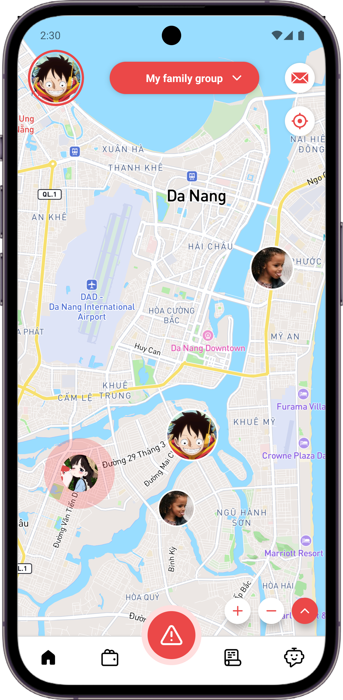
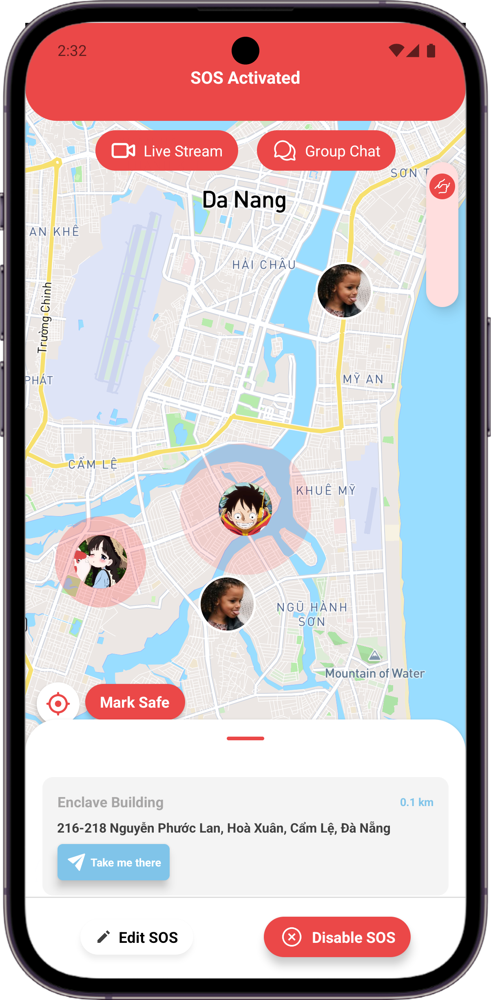
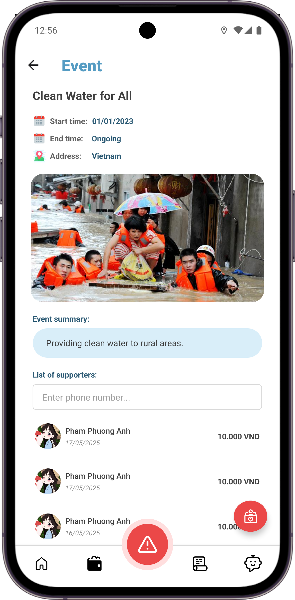

# 📱 Senior Project - Mobile Application

> A React Native mobile application developed as our university senior project

  

  <h3>🚀 Showcasing Mobile Development Excellence</h3>
  
<em>Built with React Native • Cross-Platform • University Senior Project</em>

## 🎓 About This Project

This repository contains the **mobile application source code** for our senior project, developed as part of our university graduation requirements. We've made the React Native app public to showcase our work and development skills.

**Note:** This repository contains only the mobile application code. The backend services remain private for security and intellectual property reasons.

## 👥 Team

- **[Van Thi Bach Duong]** - Mobile Developer
- **[Nguyen Huu Tung]** - Backend Developer

## 🚀 Features

- Cross-platform mobile application built with React Native
- Modern UI/UX design
- [Add specific features of your app here]
- [Add more features as needed]

## 📱 Screenshots

### Main Application Flow

  
  

  
  

## 🛠️ Tech Stack

### Mobile Application
- **React Native** - Cross-platform mobile development
- **TypeScript** - Programming language

### Backend (Private)
- Backend services and APIs are maintained in a private repository

## 🎯 Project Goals

This senior project was developed to:
- Demonstrate our mobile development skills
- Apply software engineering principles learned during our studies
- Create a functional cross-platform mobile application
- Showcase our ability to work as a team on a complex project

## 📝 License

This project is licensed under the MIT License - see the [LICENSE](LICENSE) file for details.

## 📞 Contact

- **[Van Thi Bach Duong]** - [https://www.facebook.com/bach.duong.788778]
- **[Tung Nguyen]** - []

## 🙏 Acknowledgments

- Our university professors and mentors

---

**⭐ If you found this project interesting, please consider giving it a star!**

*This project was developed as part of our university senior project requirements and serves as a demonstration of our mobile development capabilities.*