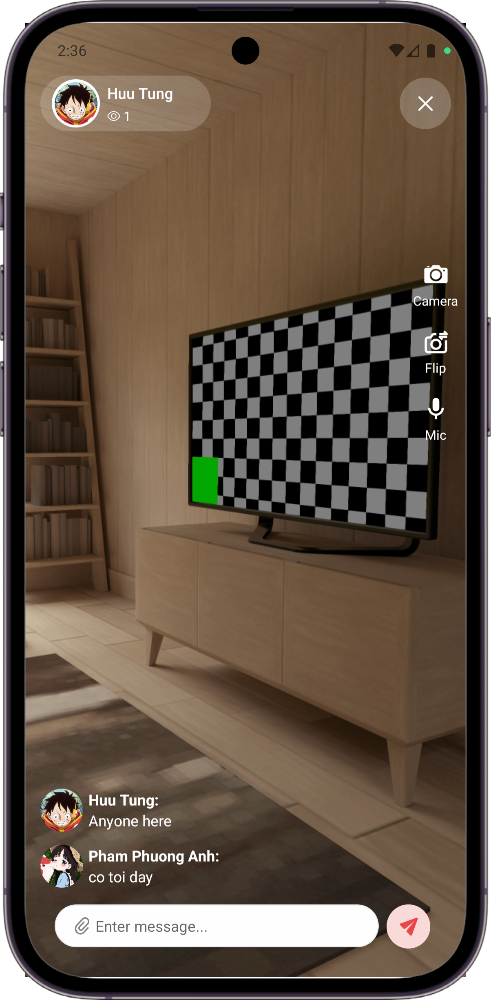
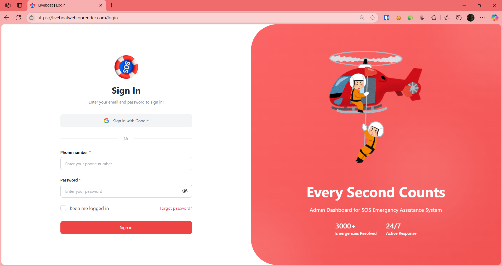
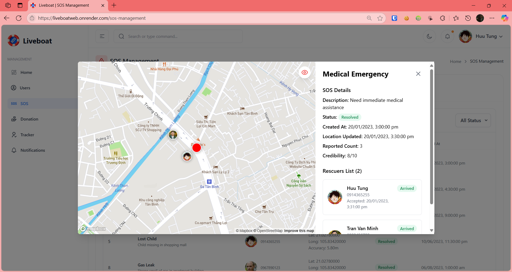
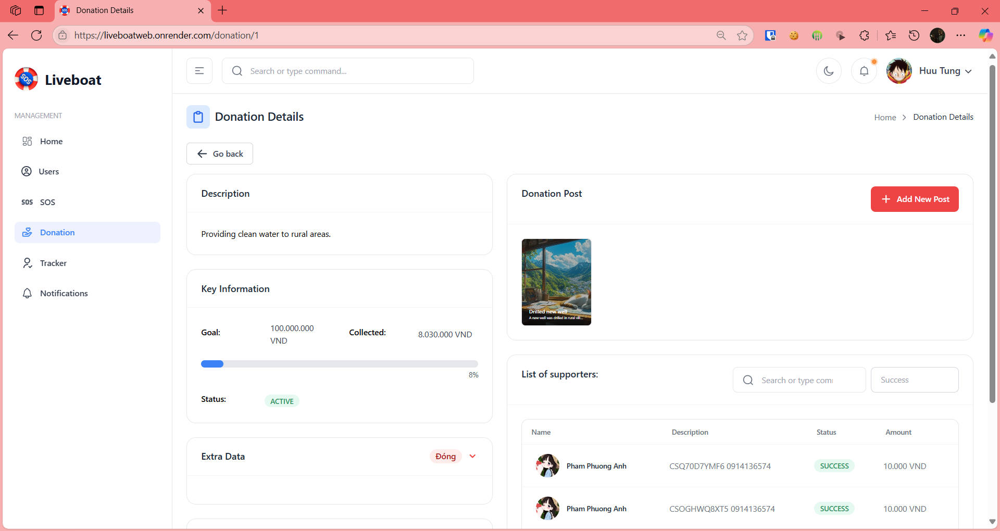

# 📱 Senior Project - Mobile Application

> A React Native mobile application developed as our university senior project

  

  <h3>🚀 Showcasing Mobile Development Excellence</h3>
  
<em>Built with React Native • Cross-Platform • University Senior Project</em>

## 🎓 About This Project

This repository contains the **mobile application source code** for our senior project, developed as part of our university graduation requirements. We've made the React Native app public to showcase our work and development skills.

**Note:** This repository contains only the mobile application code. The backend services remain private for security and intellectual property reasons.

## 👥 Team

- **[Van Thi Bach Duong]** - Mobile/Web Developer
- **[Nguyen Huu Tung]** - Backend Developer

## 🚀 Features

### 📱 Mobile Application
- **Cross-platform** - Built with React Native for iOS and Android
- **SOS System** - Quick emergency alert functionality with live streaming capabilities
- **Real-time** - Live streaming, live location and instant messaging features
- **Modern UI/UX** - Intuitive and responsive user interface
- **Push Notifications** - Real-time alerts and updates

### 🌐 Web Application
- **Responsive** - Accessible on desktop and mobile browsers
- **SOS System** - Comprehensive emergency history and analytics

## 📱 Showcase

### Mobile App

  
  
  
  

### Web App

  
  
  

## 🛠️ Tech Stack

### Mobile Application
- **React Native** - Cross-platform mobile development

### Web Application
- **ReactJs** - Web development

### Backend (Private)
- Backend services and APIs are maintained in a private repository

## 🎯 Project Goals

This senior project was developed to:
- Demonstrate our mobile development skills
- Apply software engineering principles learned during our studies
- Create a functional cross-platform mobile application
- Showcase our ability to work as a team on a complex project

## 📝 License

This project is licensed under the MIT License - see the [LICENSE](LICENSE) file for details.

## 📞 Contact

- **[Van Thi Bach Duong]** - [https://www.facebook.com/bach.duong.788778]
- **[Tung Nguyen]** - []

## 💝 Acknowledgments

We would like to express our sincere gratitude to **Our University Professors** and **Mentors** for their invaluable guidance, technical expertise, and continuous support throughout this project

---

**⭐ If you found this project interesting, please consider giving it a star!**

*This project was developed as part of our university senior project requirements and serves as a demonstration of our mobile development capabilities.*